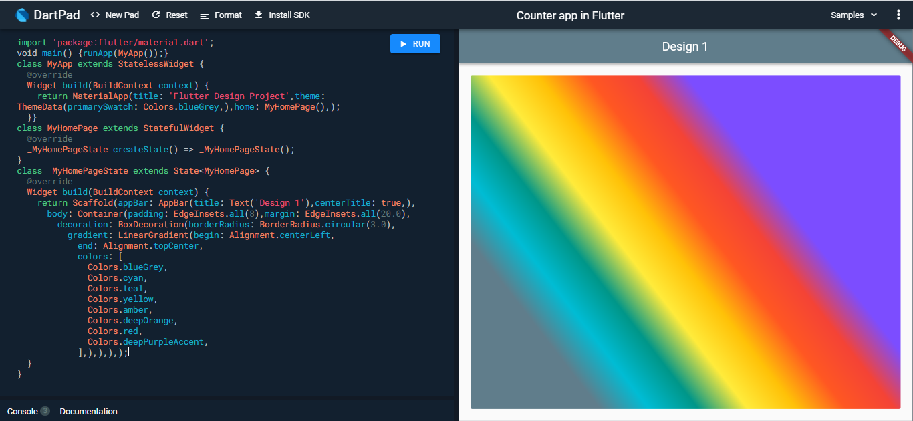

# flutter_design_epic1

Examples of Gradient

## Using Linear Gradient

with begin: Alignment.centerLeft, end: Alignment.topCenter

```
 body: Container(
        padding: EdgeInsets.all(8),
        margin: EdgeInsets.all(20.0),
        decoration: BoxDecoration(
          borderRadius: BorderRadius.circular(3.0),
          gradient: LinearGradient(
            begin: Alignment.centerLeft,
            end: Alignment.topCenter,
            colors: [
              Colors.blueGrey,
              Colors.cyan,
              Colors.teal,
              Colors.yellow,
              Colors.amber,
              Colors.deepOrange,
              Colors.red,
              Colors.deepPurpleAccent,
            ],
          ),
        ),
      ),

```



## Getting Started

This project is a starting point for a Flutter application.

A few resources to get you started if this is your first Flutter project:

- [Lab: Write your first Flutter app](https://flutter.dev/docs/get-started/codelab)
- [Cookbook: Useful Flutter samples](https://flutter.dev/docs/cookbook)

For help getting started with Flutter, view our
[online documentation](https://flutter.dev/docs), which offers tutorials,
samples, guidance on mobile development, and a full API reference.

```

```
